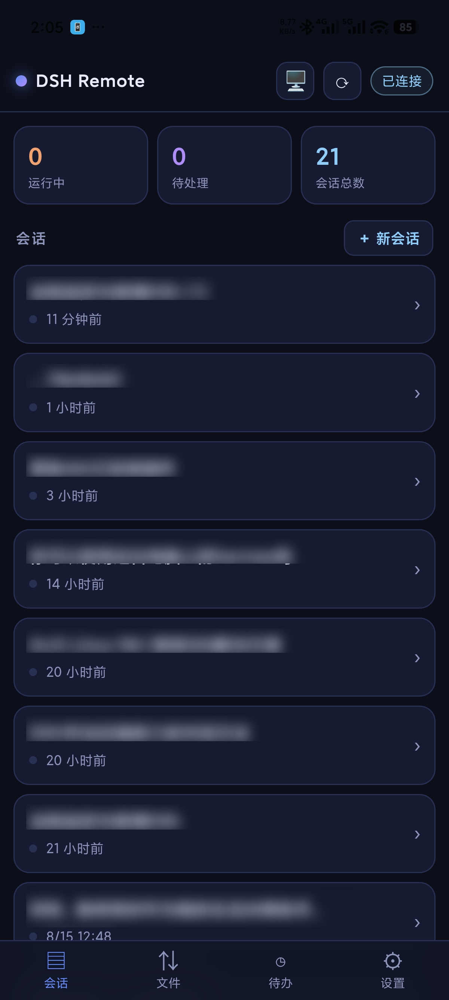
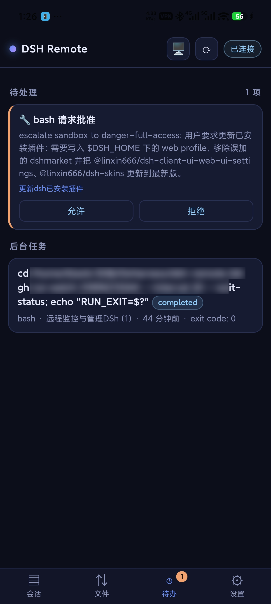
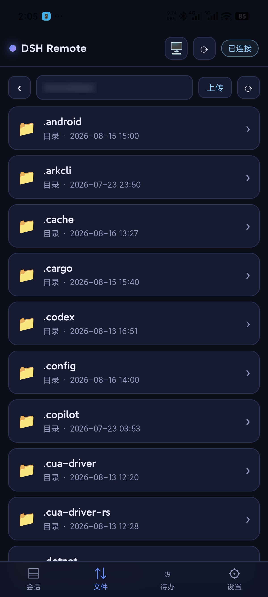
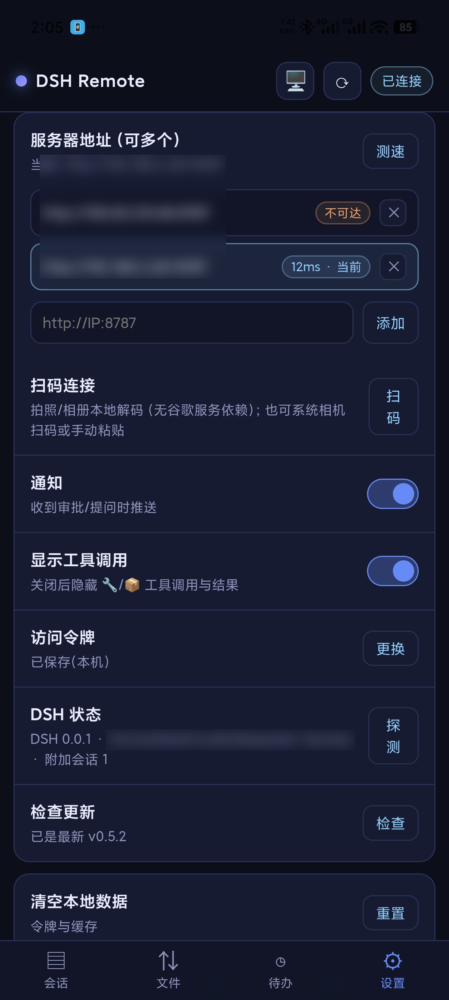
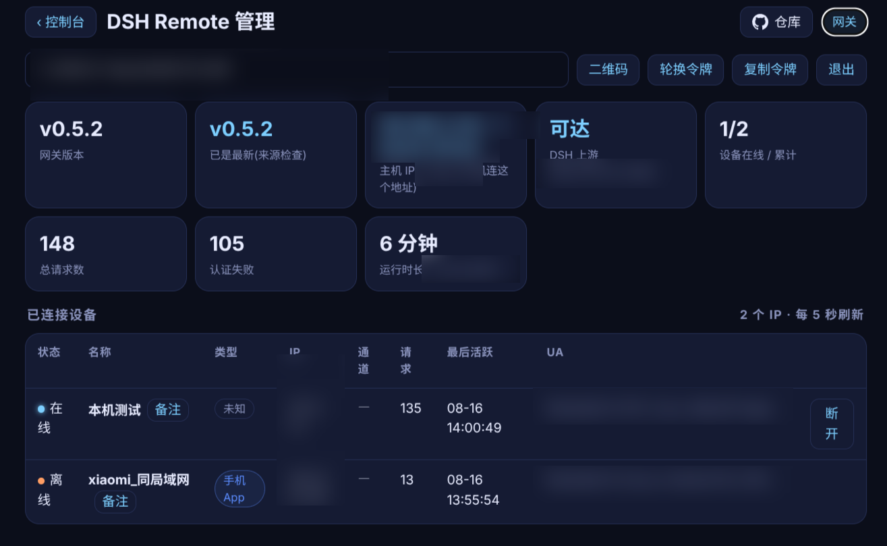

# 📱 DSH Remote

> **The DSH console in your pocket** — remote sessions · approvals · questions · file transfer, over LAN / Tailscale

**English** · [中文](README.md)

[](https://github.com/awesome-dsh-plugin/awesome-dsh-plugin)
[](https://www.npmjs.com/package/dsh-remote-plugin)
[](https://www.npmjs.com/package/dsh-remote-plugin)
[](https://github.com/Blank-not-black/dsh-Remote/releases/latest)
[](https://github.com/Blank-not-black/dsh-Remote)
[](LICENSE)
[-blue)](#)
[](https://github.com/Blank-not-black/dsh-Remote/actions/workflows/release-build.yml)
[](https://github.com/Blank-not-black/dsh-Remote/actions/workflows/dsh-compat.yml)

Approve DSH tool calls from bed. Check sessions from the couch. Push photos from your phone straight into the server — **an Android app (Capacitor hybrid app with a native camera plugin), not a PWA wrapper**. Install the app and go; the Windows / Linux single-file gateway needs no Node environment.

**Plugin + built-in gateway + Android app are one unit**: installing the plugin ships the gateway with it and keeps it running alongside DSH; the drawer hands you the token and host IP directly, and the app is ready to control DSH from anywhere.

## 📥 Downloads

| Platform | File | Notes |
| --- | --- | --- |
| Android | `dsh-remote.apk` | Remote sessions / approvals / questions / goals / file transfer; QR pairing and in-app updates |
| Windows x64 | `dsh-remote-win-x64.exe` | Single-file gateway, double-click to run, no Node needed |
| Linux x64 | `dsh-remote-linux-x64` | Single-file gateway, `chmod +x` and run, no Node needed |
| macOS (Apple Silicon) | `dsh-remote-macos-arm64` | **Preview**: CI-built, not verified on real hardware, slower update cadence — see note below |

## ⚔️ Native dsh web vs dsh-remote

| Capability | Native dsh web | dsh-remote |
| --- | --- | --- |
| Mobile support | None (desktop UI is not narrow-screen friendly) | Android app + narrow-screen WebUI |
| Access | Bound to 127.0.0.1, local only | QR pairing; LAN / Tailscale / public tunnel |
| File transfer | None | 2 GB resumable transfer + SHA-256 check |
| Multiple servers | Single instance | Multi-server latency switching |
| Offline use | Depends on the desktop being online | App offline cache |
| Account | — | No account required |

## 🛡️ Quality

- **Automated tests**: currently 16 tests covering auth / path traversal / symlink escape / Range / resumable SHA-256 uploads / event polling / token stats / release consistency.
- **CI builds**: APK + Linux/Win single-file gateway + npm publish + standalone repo sync.
- **Editor Picks**: [](https://github.com/Ericwong5021/deepseek-plugin-store#editor-picks)
- **Listed in**: awesome-dsh-plugin / Oh-My-DSH / dsh-suite / dsh-plugins-store / vlln/plugin-registry.
- **DSH Compat**: weekly automated check that the plugin installs and loads on the latest DSH (compat workflow).

## ✨ Highlights

| | |
| --- | --- |
| 📱 **Android app (Capacitor)** | Not a PWA wrapper: sessions / approvals / questions / goals / file transfer, all in one app |
| 🔐 **Self-healing gateway** | Auto-starts and restarts with DSH; Bearer-token auth — whoever has the token controls DSH |
| 📦 **2 GB file transfer** | Direct `/fs/*` transfer with **resumable uploads** + pause/resume/cancel + **SHA-256 integrity check** |
| ⚡ **Auto server switching** | Add LAN / Tailscale addresses; latency test picks the fastest one automatically |
| 🛡️ **Path security** | Path traversal and symlink escapes rejected; upload roots configurable via whitelist |
| 📴 **Offline cache** | Session list and viewed history stay browsable when the gateway is unreachable |
| 🔄 **QR pairing** | Scan a QR in the drawer — server address + token configured in one step |
| 🪟 **Single-file gateway** | Node-free standalone binaries for Windows / Linux; Apple Silicon preview available for macOS |
| 📊 **Token stats** | Built-in stats page in the admin panel and the app: four buckets today / cost / peak share and a 7-day chart, priced by Beijing peak hours |
| 🖥️ **Desktop WebUI** | Open the gateway URL in a desktop browser and get the desktop layout (sidebar sessions + files + settings + stats drawer + approval notification stack); phones automatically get the app UI |
| 💬 **Three-end feedback** | Entry points in the app top bar / desktop sidebar / admin top-right; write feedback directly in the app, forwarded by the gateway to a self-hosted collector — no tokens required |
| 🎨 **Four themes** | Default Deep Space / Sunset / Elbphilharmonie / Prairie Tower, switchable from a panel; follows system light/dark by default |

## 📸 Screenshots

| Android app | Android app |
| --- | --- |
|  |  |
|  |  |

| Gateway admin panel | |
| --- | --- |
|  | |

## ❓ FAQ

<details>
<summary><b>QR pairing / scan fails — what should I do?</b></summary>

- Make sure the phone and PC are on the same LAN, or both are signed into the same Tailscale network.
- Check the firewall allows port 8787: Linux `sudo firewall-cmd --permanent --add-port=8787/tcp && sudo firewall-cmd --reload`; Windows allow on the first-run prompt.
- Fall back to manual pairing: in App Settings add `http://PC-IP:8787`, then paste the token from the drawer.
- If you rotated the token recently, the old QR is invalid — generate a new one and scan again.

</details>

<details>
<summary><b>I lost my token / want to rotate it</b></summary>

- The token lives on the host at `~/.dsh-remote/token`; you can view it with `cat ~/.dsh-remote/token`.
- The plugin drawer or the standalone `/admin` page has **one-click rotation**: after rotation the old token is invalid immediately, and phones / browsers must pair again.
- The token is the key to controlling DSH — keep it safe.

</details>

<details>
<summary><b>Update available, but download fails?</b></summary>

- If you see "the file for this version is not on the server yet": this is usually the CI publish window — `update.json` is updated before the Release assets finish uploading; wait a few minutes and retry.
- Newer app versions download the APK first and verify it against the SHA-256 in `update.json`; on mismatch you get "Downloaded file is corrupted, please retry" and installation is blocked.
- Older release files without a `sha256` field skip verification; update the app to get the safer path.

</details>

<details>
<summary><b>No realtime updates behind a public tunnel?</b></summary>

- Cloudflare quick tunnel, Tailscale Serve, ngrok, etc. do not always proxy WebSocket / long-lived connections well — the UI opens and messages send, but updates do not arrive in real time.
- dsh-remote degrades automatically: after 3 consecutive WebSocket failures it switches to **polling mode** (incremental events every 3-5 s). Sending and receiving messages still work; only the delay changes.
- Every 30 s it tries to reopen WebSocket and switches back as soon as it succeeds.

</details>

<details>
<summary><b>Port 8787 is already in use</b></summary>

- Standalone gateway: `PORT=9000 ./dsh-remote-linux-x64` or `PORT=9000 node gateway.js`.
- Plugin mode: use `DSH_REMOTE_GATEWAY_PORT=9000` to set the gateway port.
- After changing the port, point the phone / browser to the new port.

</details>

<details>
<summary><b>How do I auto-start the Windows single-file gateway?</b></summary>

- The easiest way is to install the plugin and let the DSH plugin manage the gateway lifecycle.
- For the standalone binary, use Windows **Task Scheduler**: create a task → trigger "At log on" or "At startup" → action starts `dsh-remote-win-x64.exe`.
- To hide the console window, run it as "whether user is logged on or not" or wrap it with `wscript`.

</details>

<details>
<summary><b>What happens when the dorm / office loses power?</b></summary>

- Gateway self-healing is on by default (`~/.dsh-remote/gateway.enabled` = `on`): after a DSH restart or unexpected gateway exit, the plugin relaunches it within seconds.
- When power returns and the system boots, DSH Web starts and the plugin restores the gateway; the phone app auto-reconnects / re-tests servers.
- To disable automatic management entirely: start DSH Web with `DSH_REMOTE_AUTOSTART=0`, or click **Stop gateway** in the drawer.

</details>

<details>
<summary><b>Can't install a plugin published earlier today?</b></summary>

- This is pnpm's `minimumReleaseAge` gate: packages published the same day are rejected by default.
- Fix: add `minimumReleaseAge: 0` to the profile's `pnpm-workspace.yaml`, or install with `pnpm install --minimum-release-age=0`.
- dsh-remote's CI compatibility job already applies this, verifying the plugin loads on the latest DSH.

</details>

## 🚀 Quick start

```sh
# One command installs the plugin (gateway ships inside; auto-starts with DSH)
dsh plugin --profile web add dsh-remote-plugin
```

1. Restart DSH Web, hard-refresh the browser (**Ctrl+F5**)
2. Find the **DSH Remote** entry at the bottom of the left sidebar — the drawer shows **token, host IP, device monitor**; nothing to download or configure manually
3. Install `dsh-remote.apk` from [Releases](https://github.com/Blank-not-black/dsh-Remote/releases/latest), open App **Settings → Scan to connect**, scan the QR from the drawer — pairing done
4. On a desktop browser, open `http://PC-IP:8787` — it auto-switches to the desktop WebUI (narrow windows and phone browsers keep the app UI)

> The plugin is also installable from git sources:
> ```sh
> # 2) monorepo git source
> dsh plugin --profile web add "github:Blank-not-black/dsh-Remote#main&path:/packages/plugin"
> # 3) standalone plugin repo (Oh-My-DSH catalog entry)
> dsh plugin --profile web add "github:Blank-not-black/dsh-remote-plugin#main"
> ```

## 🧩 Components

| Component | Role | Install |
| --- | --- | --- |
| DSH plugin (`packages/plugin`) | Native sidebar entry + drawer admin panel; **bundles the gateway and manages its lifecycle** | one `dsh plugin` command |
| Gateway (`gateway.js` / single-file binary) | Token-authenticated proxy on port 8787 + device monitor + update check + **`/fs/*` file transfer**; auto-started by the plugin | bundled with plugin; also standalone |
| Android app (`dsh-remote.apk`) | Remote sessions/approvals/questions/goals/file transfer; in-app update check | GitHub Releases |

## ⚙️ Gateway lifecycle & self-healing

- The drawer's **Stop gateway / Start gateway** buttons control it; intent persists in `~/.dsh-remote/gateway.enabled`
- **Default `on`**: after a DSH restart or an unexpected gateway exit, the plugin relaunches it within seconds
- Clicking **Stop gateway** writes `off` — no auto-restart until you click Start; disable management entirely with `DSH_REMOTE_AUTOSTART=0`
- Token lives in `~/.dsh-remote/token` (auto-generated on first run, reused afterwards)

## 📲 Android app

1. Install `dsh-remote.apk` from [Releases](https://github.com/Blank-not-black/dsh-Remote/releases/latest)
2. **Recommended: QR pairing** — open the plugin drawer (or the standalone gateway's `/admin` page), click **QR code**, scan it in App **Settings → Scan to connect**; address + token configured in one go
3. Manual setup: copy the drawer's **token** and **host IP**; add server addresses in App Settings (multiple allowed, e.g. LAN `http://192.168.x.x:8787` + Tailscale `http://100.x.x.x:8787`), tap **Test latency** to auto-select the fastest; then paste the token
4. The mobile browser can also open `http://<PC-IP>:8787/?token=xxx` directly

- **Firewall**: when the phone can't reach the gateway, open port 8787 — Linux: `sudo firewall-cmd --permanent --add-port=8787/tcp && sudo firewall-cmd --reload`; Windows: allow on first-run prompt
- **In-app updates**: Settings → Check for updates, one-tap download & install

### What you can do on the phone

| Tab | Features |
| --- | --- |
| Sessions | Session list, run-state/goal badges, stats, new session |
| Detail | Live conversation, scroll-up history, goal control (pause/resume/complete/edit/clear), subagent interrupt, send message, stop task |
| Files | Browse/enter/back, pull-to-refresh, download to system `Download/dsh-remote` folder (DownloadManager), upload with progress, **pause/resume/cancel + SHA-256 check** |
| Approvals | Tool-call approvals (allow/deny), user questions (choose/custom answer), background tasks |
| Stats | Today's four token buckets, cost, peak share, and a 7-day cost chart |
| Settings | Multiple server addresses (latency-test auto-switch), token, **scan to connect**, notifications toggle, tool-call display, DSH status probe, update check |

> 💾 Chat history is cached locally per session: sessions and viewed history stay browsable offline when the gateway is unreachable.

## 📁 File transfer (LAN / Tailscale direct)

`/fs/*` endpoints power the Files tab in both the app and the browser console. Everything is direct-connection: uploads default to **2 GB** max (configurable), both directions support **resumable transfer**; app uploads support **pause/resume/cancel** with a **SHA-256 integrity check** before final write (mismatched chunks are kept, never written into the target directory).

| Endpoint | Method | Description |
| --- | --- | --- |
| `/fs/list?path=xxx` | GET | List directory; `path` defaults to `~`; returns `{path, entries:[{name,type,size,mtimeMs}]}` |
| `/fs/file?path=xxx` | GET | Streaming download; supports `Range: bytes=a-b`; UTF-8 filename in `Content-Disposition` |
| `/fs/upload?path=dir&name=file` | POST | Raw body or `multipart/form-data`; 409 on name collision, add `overwrite=1` |
| `/fs/upload?…&session=uuid&offset=N[&finish=1][&sha256=hex]` | POST | **Chunked resume**: each chunk written at offset of `.name.dsh-remote-part-<session>`; on `finish=1` verifies `sha256` then atomically renames, 422 on mismatch |
| `/fs/upload-probe?path=..&name=..&session=..` | GET | Query uploaded chunk size (probe before resuming after disconnect) |
| `/fs/upload-control?path=..&name=..&session=..&action=cancel` | POST | Cancel upload: stop in-flight write stream and delete chunks (pause = client disconnects, chunks kept) |

- **Auth**: every `/fs/*` request requires the token — `Authorization: Bearer <token>` or `?token=<token>`; missing token → 401
- **Security**: all paths are resolved and must stay inside the allowed roots (default `~`); `../` traversal and symlinks pointing outside are rejected; `DSH_REMOTE_FS_ROOT=/home/you:/mnt/data` enables multiple roots (`:`-separated)
- **Limits**: `DSH_REMOTE_FS_MAX_UPLOAD` (bytes, default `2147483648` = 2 GB)

```bash
TOKEN=$(cat ~/.dsh-remote/token); HOST=http://127.0.0.1:8787
curl -H "Authorization: Bearer $TOKEN" "$HOST/fs/list"                            # list ~
curl -H "Authorization: Bearer $TOKEN" "$HOST/fs/list?path=~/Downloads"           # list downloads
curl -OJ -H "Authorization: Bearer $TOKEN" "$HOST/fs/file?path=~/Downloads/big.iso" # download (resume: add -r 0-1048575)
curl -H "Authorization: Bearer $TOKEN" --data-binary @./photo.jpg \
     "$HOST/fs/upload?path=~/Downloads&name=photo.jpg"                             # upload; append &overwrite=1 on 409
```

## 🖥️ Drawer / admin panel

- Gateway version / uptime / host IPs / DSH upstream status / request stats
- **Token stats**: today's four buckets (uncached input / cache read / cache write / output), cost and peak share, 7-day peak/off-peak chart; stats start from the 2026-08-17 pricing date, amounts are token-based estimates valid only with the official DeepSeek API — **always defer to the official bill**
- **Connected devices**: type (app / browser / admin), IP, online state, request count, channel, last active — annotate and disconnect
- Token display + one-click copy; **token QR** (app pairing) and **one-click rotation** (old token invalidated instantly, devices must re-pair); GitHub update check (every 6 h)

## 🚪 Standalone gateway (no plugin / Windows hosts)

Run the gateway on its own when you don't want the plugin or the host has no systemd:

| Platform | File |
| --- | --- |
| Windows x64 | `dsh-remote-win-x64.exe` (double-click, no Node needed) |
| Linux x64 | `dsh-remote-linux-x64` (`chmod +x` and run) |
| macOS (Apple Silicon) | `dsh-remote-macos-arm64` (**preview**, see note below) |

> ⚠️ **macOS preview note**: the author has no macOS device, so this binary is built and ad-hoc signed by CI only and has **not been verified on real hardware**. If you hit a bug, please **file an issue** at [Issues](https://github.com/Blank-not-black/dsh-Remote/issues/new/choose). The macOS version **updates significantly less often than the Windows / Linux versions**, and is only rebuilt manually when needed. It is not notarized by Apple: on first launch, if Gatekeeper blocks it, right-click **Open**, or run `xattr -d com.apple.quarantine dsh-remote-macos-arm64`. Previews are published to a separate [macOS Preview Release](https://github.com/Blank-not-black/dsh-Remote/releases/tag/v0.5.5-macos-preview) and do **not** follow the main version number.

```bash
./dsh-remote-linux-x64            # default 0.0.0.0:8787
PORT=9000 ./dsh-remote-linux-x64  # custom port
TOKEN=xxx ./dsh-remote-linux-x64  # fixed token (otherwise generated to ~/.dsh-remote/token)
```

Admin page at `http://127.0.0.1:8787/admin` (token required in standalone mode): host IPs, upstream reachability, device monitor, annotate/disconnect devices, GitHub update check, **token QR & one-click rotation**.

## 🌐 Remote access (cross-network)

Outside LAN, use **Tailscale** (free, zero-trust mesh, encrypted): sign all devices into the same account and they can reach each other — no gateway config change needed (it listens on `0.0.0.0` by default, so Tailscale traffic is directly reachable).

**Scenario 1: Control your PC from your phone** (PC at work/school runs DSH, control it from home on the phone)

1. Install Tailscale on both PC and phone, signed into the same account
2. In App Settings, add `http://<PC's Tailscale IP>:8787` (multiple addresses + notes + groups supported; latency test auto-selects the fastest)
3. Link is encrypted; auto-reconnects after network changes

**Scenario 2: Control one PC from another PC** (work PC runs DSH, control it from your home PC)

1. Install Tailscale on both PCs, signed into the same account
2. Open `http://<workPC's TailscaleIP>:8787` in the browser on your home PC — **the desktop WebUI loads automatically** (sidebar sessions + files + settings + stats drawer + approval notification stack)
3. Want it to feel like a desktop app? Chrome/Edge → "Install dsh-remote" as a PWA — its own window, taskbar icon, no address bar

> 💡 Where to find the Tailscale IP: `tailscale status` (CLI) or tray icon → Admin console. With MagicDNS you can also use the machine name directly (e.g. `http://hpnya:8787`).

## 🌐 Network & tunnel compatibility

- **LAN / Tailscale**: WebSocket works directly, realtime push is normal.
- ✅ **Tested (2026-08-18)**: Cloudflare quick tunnel passes WebSocket through normally, messages stay realtime, no fallback needed.
- **Public tunnels (Cloudflare quick tunnel, Tailscale Serve, ngrok, etc.)**: some tunnels do not fully support WebSocket / long-lived connections — the UI opens and messages send, but updates may not arrive in real time.
- dsh-remote **degrades to polling automatically**: after 3 consecutive WebSocket failures the frontend pulls incremental events from the gateway (`/api/events.poll`) every 3-5 seconds, and tries to restore WebSocket every 30 seconds, switching back automatically on success.
- **Sending and receiving messages still work** while degraded; only realtime changes to a few seconds of delay, and the status bar shows "Polling".

## 🏗️ Architecture

**Integrated mode (recommended)**

```
DSH web (3080)
   ├─ dsh-remote plugin /remote ──► host browser: sidebar entry + drawer admin
   └─ auto lifecycle ──► dsh-remote-gateway.service (0.0.0.0:8787, Bearer token)
                              ▲
       Android app / mobile browser (LAN or Tailscale)
       static assets + auth + /api/* proxy + device monitor
                              │
                              ▼
                         DSH web (127.0.0.1:3080)
```

**Standalone gateway mode** (same `gateway.js` single file, no plugin)

```
Mobile browser / Android app ── http://PC-IP:8787 + token ──► gateway.js ──► DSH web (127.0.0.1:3080)
```

- Everything goes through DSH's official `/api` RPC (`session.*` / `subagent.*` / `goal.*`), event streams over WebSocket with auto-reconnect
- The gateway stores no business data; tokens live only on the host and your phone. **⚠️ Whoever holds the token controls DSH — keep it safe.**

## 🔧 Run from source

Requires Node.js ≥ 18:

```bash
git clone https://github.com/Blank-not-black/dsh-Remote.git
cd dsh-Remote
npm install
npm start        # gateway, default 0.0.0.0:8787
```

## 🛠️ Development & release

```bash
npm run sync-plugin       # sync public/ into plugin package + copy gateway.cjs + plugin update.json
npm run sync-standalone   # generate/push dsh-remote-plugin standalone repo (Oh-My-DSH entry)
npm run build-app         # build Android APK (needs Android SDK; fixed signing in android/app/build.gradle)
npm run build-bin         # package Windows/Linux single-file binaries
npm run publish           # copy APK + update.json + sync plugin package
```

**Fully automated release**: edit `updateNotes` in `package.json`, then one command:

```bash
npm run release 0.5.0    # bump version → build APK+plugin locally → commit → push main → tag & push
```

After the tag is pushed, CI (`.github/workflows/release-build.yml`) takes over: builds APK + Linux/Win binaries → generates `SHA256SUMS.txt` and changelog → uploads GitHub Release → publishes npm → syncs the standalone repo. Repository secrets needed once: `NPM_TOKEN`, `DSH_RELEASE_DEPLOY_KEY`.

**macOS preview (separate flow)**: decoupled from the main version number — it does **not** follow the Android / Windows / Linux release cadence. When needed, manually run `.github/workflows/macos-preview.yml` (Actions → macos-preview → Run workflow); CI builds `dsh-remote-macos-arm64` from the current `package.json` version and publishes it to a separate prerelease.

## 💬 Feedback

There are entry points in all three UIs: the app top-bar 💬, the desktop sidebar bottom, and the admin top-right. **"Write feedback" in the app / desktop menu submits directly** — the gateway forwards it to the feedback collector:

- Default collector: `http://100.84.128.29/submit` (Tailscale internal network), overridable via the `DSH_REMOTE_FEEDBACK_URL` environment variable
- The gateway validates input and throttles for 1 minute **after a successful submission only** (failures don't block retries); the collector has its own defense layer. **No tokens to configure.**
- You can also jump to [GitHub Issues](https://github.com/Blank-not-black/dsh-Remote/issues/new/choose), Gitee or Bilibili from the menu, or chat in [Discussions](https://github.com/Blank-not-black/dsh-Remote/discussions) — usage questions go to Discussions, confirmed bugs / feature requests go to Issues.

## 📄 License

MIT
