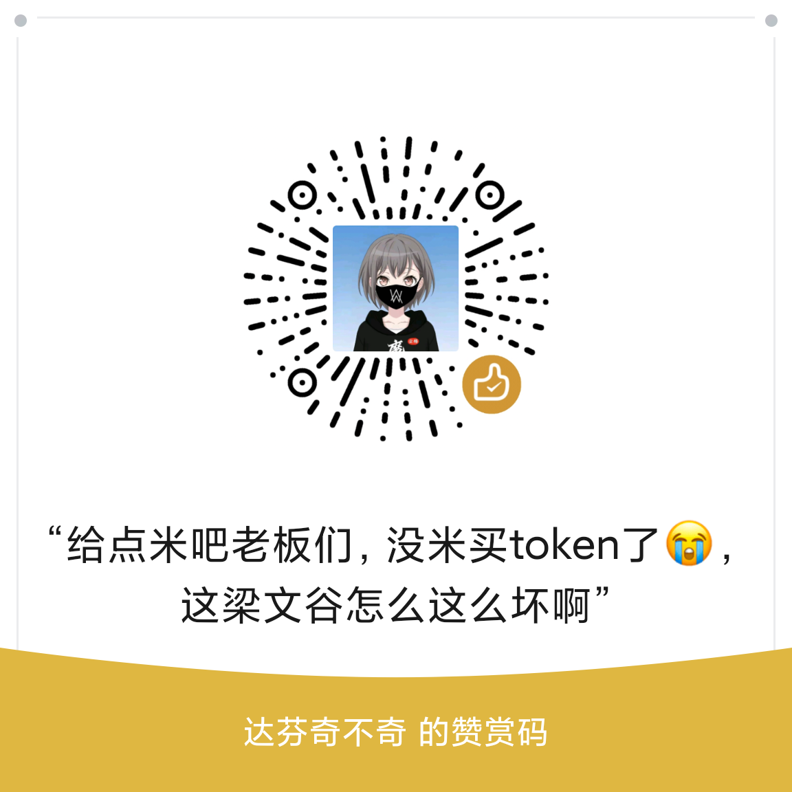

# 📱 DSH Remote

> **口袋里的 DSH 控制台** —— 手机远程会话 · 审批 · 提问 · 文件互传，局域网 / Tailscale 都能用

**中文** · [English](README.en.md)

[](https://github.com/awesome-dsh-plugin/awesome-dsh-plugin)
[](https://www.npmjs.com/package/dsh-remote-plugin)
[](https://www.npmjs.com/package/dsh-remote-plugin)
[](https://github.com/Blank-not-black/dsh-Remote/releases/latest)
[](https://github.com/Blank-not-black/dsh-Remote)
[](LICENSE)
[-blue)](#)
[](https://github.com/Blank-not-black/dsh-Remote/actions/workflows/release-build.yml)
[](https://github.com/Blank-not-black/dsh-Remote/actions/workflows/compat.yml)

躺床上也能批准 DSH 的工具调用、随时查看会话、把手机照片直接传进服务器——**安卓 App（Capacitor 混合应用，含相机原生插件），不是 PWA 网页套壳**。装 App 即用；Windows / Linux 单文件网关，无需 Node 环境。

**插件 + 内置网关 + 手机 App 是一个整体**：装插件时网关随插件分发、随 DSH 自动启停，抽屉里直接拿到令牌和主机地址，手机 App 填上即可远程操控 DSH。

## 📥 下载

| 平台 | 文件 | 说明 |
| --- | --- | --- |
| Android | `dsh-remote.apk` | 手机远程会话 / 审批 / 提问 / goal / 文件互传，支持扫码配对与 App 内更新 |
| Windows x64 | `dsh-remote-win-x64.exe` | 单文件网关，双击运行，免 Node 环境 |
| Linux x64 | `dsh-remote-linux-x64` | 单文件网关，`chmod +x` 后运行，免 Node 环境 |
| macOS (Apple Silicon) | `dsh-remote-macos-arm64` | **预览版**：CI 盲验、未真机验证，功能更新周期较长，见下方说明 |

## ⚔️ 原生 dsh web vs dsh-remote

| 能力 | 原生 dsh web | dsh-remote |
| --- | --- | --- |
| 手机端 | 无（桌面 UI 不适配窄屏） | 安卓 App + 窄屏 WebUI |
| 访问方式 | 绑定 127.0.0.1 仅本机 | 扫码配对，局域网 / Tailscale / 公网均可 |
| 文件传输 | 无 | 2GB 断点续传 + SHA-256 校验 |
| 多服务器 | 单实例 | 多服务器测速切换 |
| 离线使用 | 依赖桌面在线 | App 离线缓存 |
| 账号要求 | — | 免账号 |

## 🛡️ 质量保障

- **自动化测试**：当前 16 项测试覆盖鉴权 / 路径穿越 / 符号链接逃逸 / Range / 断点续传 SHA-256 / 事件轮询 / Token 统计 / 发布一致性。
- **CI 自动构建**：APK + Linux/Win 单文件网关 + npm 发布 + 独立仓库同步。
- **Editor Picks 精选**：[](https://github.com/Ericwong5021/deepseek-plugin-store#editor-picks)
- **多市场收录**：awesome-dsh-plugin / Oh-My-DSH / dsh-suite / dsh-plugins-store / vlln/plugin-registry。
- **DSH Compat**：每周自动在最新 DSH 上验证插件可安装、可加载（compat workflow）。

## ✨ 亮点

| | |
| --- | --- |
| 📱 **安卓 App（Capacitor）** | 不是 PWA 套壳：会话 / 审批 / 提问 / goal / 文件互传，一个 App 全搞定 |
| 🔐 **自愈网关** | 插件内置网关随 DSH 自动启停，挂了自动拉起；Bearer token 鉴权，谁拿 token 谁操控 |
| 📦 **2GB 文件互传** | `/fs/*` 直连传输，**断点续传** + 暂停/继续/取消 + **SHA-256 完整性校验** |
| ⚡ **多服务器自动切换** | 局域网 / Tailscale 地址全填上，测速自动选当前最快的 |
| 🛡️ **路径安全** | 路径穿越与符号链接逃逸全拒绝，上传根可白名单配置 |
| 📴 **离线缓存** | 网关断线时，会话列表和看过的历史仍可离线浏览 |
| 🔔 **后台轮询（Android）** | App 退后台后由前台服务每 30 秒～15 分钟拉取事件，待办审批/提问不遗漏；灭屏后 Doze 会拉长间隔（平台限制） |
| 🔄 **令牌二维码配对** | 抽屉里扫个码，服务器地址 + 令牌一次配好 |
| 🪟 **单文件网关** | Windows / Linux 免 Node 单文件二进制，独立部署也成；macOS 提供 Apple Silicon 预览版 |
| 📊 **Token 统计** | 管理页 + App 内置统计页：今日四桶 / 费用 / 高峰占比与近 7 日柱状图，按北京时间高峰计费 |
| 🖥️ **桌面端 WebUI** | 浏览器打开网关地址自动进入桌面布局（侧栏会话 + 文件 + 设置 + 统计抽屉 + 审批通知卡片栈），手机自动进入 App 界面 |
| 💬 **三端反馈** | App 顶栏 / 桌面端侧边栏 / 管理页右上角都有入口；App 内可直接写反馈，网关转发到自建收集器，无需任何 token |
| 🎨 **四套皮肤** | 默认深空 / 落日 / 易北爱乐厅 / 草原孤塔，面板一键切换，默认跟随系统深浅偏好 |

## 🔔 后台轮询（Android）

- **机制**：App 退后台后 WebView 会被系统挂起，实时事件收不到；开启后由 Android **前台服务**定时调用 `GET /api/events.poll?kind=mux|host&since=...` 拉取增量事件，有新事件时发系统通知。
- **间隔档位**：30 秒 / 1 分钟 / 5 分钟 / 15 分钟，默认 1 分钟；在 App「设置 → 后台轮询」里调整。
- **Doze**：灭屏后系统会冻结后台任务，实际轮询间隔可能被拉长（平台限制，非 App bug）。
- **国产 ROM**：小米 / 华为 / OPPO / vivo 等默认会杀后台，请在系统设置里允许 DSH Remote **自启动**、**后台运行**、**省电策略不限制**，否则前台服务可能被系统清理。

## 📸 截图

| 手机 App | 手机 App |
| --- | --- |
|  |  |
|  |  |

| 网关管理面板 | |
| --- | --- |
|  | |

## ❓ FAQ

<details>
<summary><b>扫码 / 配对失败怎么办？</b></summary>

- 先确认手机和电脑在同一局域网，或两边都已登录同一个 Tailscale 网络。
- 检查防火墙是否放行 8787：Linux `sudo firewall-cmd --permanent --add-port=8787/tcp && sudo firewall-cmd --reload`；Windows 首次运行弹窗点允许。
- 改用手动配对：App「设置 → 服务器地址」填 `http://电脑IP:8787`，再粘贴抽屉里的令牌。
- 如果刚轮换过令牌，旧二维码已失效，请重新生成二维码再扫。

</details>

<details>
<summary><b>token 丢了 / 想轮换怎么办？</b></summary>

- token 保存在主机 `~/.dsh-remote/token`，可以直接 `cat ~/.dsh-remote/token` 查看。
- 插件抽屉或独立网关 `/admin` 管理页提供**一键轮换**：轮换后旧 token 立即失效，手机和浏览器需要重新扫码 / 输入。
- token 等同于 DSH 的操控权，请勿泄露。

</details>

<details>
<summary><b>提示有更新但下载失败？</b></summary>

- 如果提示“服务器上还没有对应版本的文件”：通常是 CI 发布窗口期——`update.json` 已更新但 Release 资产还没传完，等几分钟再试。
- 新版本 App 会先下载 APK，并用 `update.json` 里的 SHA-256 校验；校验不通过会提示“下载文件损坏，请重试”，不会进入安装。
- 老版本产物没有 `sha256` 字段时会跳过校验，建议升级到新版本 App。

</details>

<details>
<summary><b>公网隧道下收不到实时推送？</b></summary>

- Cloudflare quick tunnel、Tailscale Serve、ngrok 等隧道对 WebSocket / 长连接支持不完整，可能出现“界面能开、消息能发、就是不实时”。
- dsh-remote 会自动降级：WebSocket 连续重连失败 3 次后切换为**轮询模式**（每 3-5 秒拉取增量事件），不影响收发消息，只是延迟数秒。
- 每 30 秒会尝试恢复 WebSocket，成功即自动切回实时推送。

</details>

<details>
<summary><b>端口 8787 被占怎么办？</b></summary>

- 独立网关：`PORT=9000 ./dsh-remote-linux-x64` 或 `PORT=9000 node gateway.js`。
- 插件模式：可用 `DSH_REMOTE_GATEWAY_PORT=9000` 指定网关端口。
- 改端口后，手机 / 浏览器访问对应新端口即可。

</details>

<details>
<summary><b>Windows 单文件网关如何开机自启？</b></summary>

- 推荐直接安装插件，由 DSH 插件负责网关自启与自愈。
- 独立网关可用 Windows「任务计划程序」：创建任务 → 触发器选“登录时”或“启动时” → 操作启动 `dsh-remote-win-x64.exe`。
- 如需隐藏控制台窗口，可在任务计划中设置“不管用户是否登录”运行，或通过 `wscript` 包装启动。

</details>

<details>
<summary><b>宿舍 / 工作日断电对服务有什么影响？</b></summary>

- 网关自愈默认开启（`~/.dsh-remote/gateway.enabled` 为 `on`）：DSH 重启或网关意外退出后，插件会在几秒内自动拉起。
- 来电开机进入系统、DSH Web 启动后，插件会自动恢复网关；手机 App 断线后会自动重连 / 重测速。
- 想彻底关闭自动管理：`DSH_REMOTE_AUTOSTART=0` 启动 DSH Web，或在抽屉里点「停止网关」。

</details>

<details>
<summary><b>当天发布的插件装不上？</b></summary>

- 这是 pnpm 的 `minimumReleaseAge` 门禁：默认会拒绝安装当天刚发布的包。
- 解法：在临时 profile 的 `pnpm-workspace.yaml` 加 `minimumReleaseAge: 0`，或安装时使用 `pnpm install --minimum-release-age=0`。
- dsh-remote 的 CI 兼容测试 job 已内置该处理，用于验证最新版 DSH 上插件可加载。

</details>

## 🚀 快速开始

```sh
# 一条命令装插件（网关随插件内置，DSH 启动时自动拉起）
dsh plugin --profile web add dsh-remote-plugin
```

1. 重启 DSH Web，浏览器 **Ctrl+F5**
2. 左侧边栏底部出现「DSH Remote」入口，点开右侧抽屉——**令牌、主机 IP、设备监控都在这里**，不用手动下载或配令牌
3. 手机装 `dsh-remote.apk`（[Releases](https://github.com/Blank-not-black/dsh-Remote/releases/latest)），App「设置 → 扫码连接」扫抽屉里的二维码，配对完成
4. 电脑浏览器直接打开 `http://电脑IP:8787` 自动进入桌面端 WebUI（窄窗口或手机浏览器则自动使用 App 界面）

> 插件有三种等价获取方式：
> ```sh
> # 1) npm 包(推荐, 可被 Oh-My-DSH / DSH 插件搜索收录)
> dsh plugin --profile web add dsh-remote-plugin
> # 2) monorepo git 源
> dsh plugin --profile web add "github:Blank-not-black/dsh-Remote#main&path:/packages/plugin"
> # 3) 插件专用 root 仓库(Oh-My-DSH 目录收录的独立包形态)
> dsh plugin --profile web add "github:Blank-not-black/dsh-remote-plugin#main"
> ```

## 🧩 组件一览

| 组件 | 作用 | 安装来源 |
| --- | --- | --- |
| DSH 插件（`packages/plugin`） | DSH 原生侧边栏入口 + 右侧抽屉管理页；**内置网关程序并自动启停** | 一条 `dsh plugin` 命令 |
| 网关（`gateway.js` / 单文件二进制） | 8787 端口的带 Token 代理 + 设备监控 + 更新检查 + **文件传输 `/fs/*`**；插件会自动拉起它 | 随插件内置；也可单独下载 |
| Android App（`dsh-remote.apk`） | 手机远程会话/审批/提问/goal/文件互传，支持 App 内检查更新 | GitHub Releases |

## ⚙️ 网关开关与自愈

- 抽屉顶部「停止网关 / 启动网关」控制网关，意图持久化在 `~/.dsh-remote/gateway.enabled`
- **默认 `on`**：DSH 重启或网关意外退出后，插件会在几秒内自动拉起
- 点「停止网关」写入 `off`，此后不会自动拉起；想整体禁用自动管理：`DSH_REMOTE_AUTOSTART=0` 启动 DSH Web
- 令牌保存在 `~/.dsh-remote/token`（首次自动生成，之后一直复用）

## 📲 手机 App

1. 从 [Releases](https://github.com/Blank-not-black/dsh-Remote/releases/latest) 下载 `dsh-remote.apk` 并安装
2. **推荐：扫码配对**——打开插件抽屉（或独立网关的 `/admin` 管理页）点「二维码」，手机 App「设置 → 扫码连接」扫一下，服务器地址和令牌一次配好
3. 也可以手动：复制抽屉里的「令牌」和「主机 IP」，App「设置」里添加服务器地址（可加多个，如局域网 `http://192.168.x.x:8787` + Tailscale `http://100.x.x.x:8787`），点「测速」自动选当前最快的；再填令牌
4. 手机浏览器也可以直接打开 `http://电脑IP:8787/?token=xxx`

- **防火墙**：手机连不上时放行 8787——Linux `sudo firewall-cmd --permanent --add-port=8787/tcp && sudo firewall-cmd --reload`；Windows 首次运行弹窗点允许
- **App 内更新**：设置 → 检查更新，发现新版一键下载安装

### 手机上能做什么

| 页面 | 功能 |
| --- | --- |
| 会话 | 会话列表、运行状态/目标徽章、统计、新建会话 |
| 详情 | 实时对话、上滑加载历史、目标控制（暂停/继续/完成/编辑/清除）、子代理中断、发消息、停止任务 |
| 文件 | 列目录/进入/返回上级、下拉刷新、下载到系统「下载/dsh-remote」子目录（DownloadManager）、选文件上传带进度，**暂停/继续/取消 + SHA-256 校验** |
| 待办 | 工具审批（允许/拒绝）、用户提问（选择/自定义回答）、后台任务 |
| 统计 | 今日 Token 四桶、今日费用、高峰占比、近 7 日费用柱状图 |
| 设置 | 多服务器地址（测速自动选最快）、令牌、**扫码连接**、通知开关、工具调用显示、DSH 状态探测、检查更新 |

> 💾 聊天记录会随会话缓存在手机本地：网关断线时，会话列表和看过的历史仍可离线浏览。

## 📁 文件传输（局域网 / Tailscale 直传）

网关提供 `/fs/*` 文件端点，手机 App 和浏览器控制台都有「文件」页。大小文件都走直连：上传上限默认 **2GB**（可调），下载与上传都支持**断点续传**；App 上传支持**暂停/继续/取消**，落盘前做 **SHA-256 完整性校验**（不匹配保留坏分片，不会把坏文件写进目标目录）。

| 端点 | 方法 | 说明 |
| --- | --- | --- |
| `/fs/list?path=xxx` | GET | 列目录；`path` 缺省为 `~`，返回 `{path, entries:[{name,type,size,mtimeMs}]}` |
| `/fs/file?path=xxx` | GET | 流式下载；支持 `Range: bytes=a-b`；`Content-Disposition` 已做 UTF-8 文件名编码 |
| `/fs/upload?path=目录&name=文件名` | POST | raw body 或 `multipart/form-data`；同名返回 409，加 `overwrite=1` 覆盖 |
| `/fs/upload?…&session=uuid&offset=N[&finish=1][&sha256=hex]` | POST | **分块续传**：每块写 `.name.dsh-remote-part-<session>` 的 offset 处；`finish=1` 时校验 `sha256` 后原子落位，不匹配返回 422 |
| `/fs/upload-probe?path=..&name=..&session=..` | GET | 查询已传分片大小（App 断线重传前先 probe 续传） |
| `/fs/upload-control?path=..&name=..&session=..&action=cancel` | POST | 取消续传：停止在途写流并删除分片（暂停 = 客户端直接断流，分片保留） |

- **鉴权**：所有 `/fs/*` 必须带 token——`Authorization: Bearer <token>` 或 `?token=<token>`；无 token 一律 401
- **安全**：所有路径 resolve 后必须位于允许根内（默认 `~`），`../` 穿越与指向根外的符号链接会被拒绝；`DSH_REMOTE_FS_ROOT=/home/you:/mnt/data` 可开多个根（Linux/macOS 用 `:`，Windows 用 `;` 分隔）
- **上限**：`DSH_REMOTE_FS_MAX_UPLOAD`（字节，默认 `2147483648` = 2GB）

```bash
TOKEN=$(cat ~/.dsh-remote/token); HOST=http://127.0.0.1:8787
curl -H "Authorization: Bearer $TOKEN" "$HOST/fs/list"                          # 列 ~
curl -H "Authorization: Bearer $TOKEN" "$HOST/fs/list?path=~/下载"               # 列下载目录
curl -OJ -H "Authorization: Bearer $TOKEN" "$HOST/fs/file?path=~/下载/大文件.iso" # 下载(带断点: 追加 -r 0-1048575)
curl -H "Authorization: Bearer $TOKEN" --data-binary @./手机照片.jpg \
     "$HOST/fs/upload?path=~/下载&name=手机照片.jpg"                              # 上传; 同名报 409 时追加 &overwrite=1
```

## 🖥️ 管理抽屉 / 管理页能看什么

- 网关版本 / 运行时长 / 主机 IP / DSH 上游状态 / 请求统计
- **Token 统计**：今日四桶（未缓存输入 / 缓存命中 / 缓存写入 / 输出）、费用与高峰占比、近 7 日峰谷柱状图；统计自 2026-08-17 定价生效日起，金额基于 token 估算，仅在使用 DeepSeek 官方 API 时有效，**一切以官网账单为准**
- **已连接设备**：类型（手机 App / 浏览器 / 管理页）、IP、在线、请求数、通道、最后活跃，支持备注与断开
- 令牌展示 + 一键复制；**令牌二维码**（手机 App 扫码配对）与**一键轮换**（旧令牌立即失效，设备需重新配对）；GitHub 更新检查（6 小时一次）

## 🚪 独立网关（无 DSH 插件 / Windows 主机）

不需要装插件、或主机没有 systemd 时，单独运行网关：

| 平台 | 文件 |
| --- | --- |
| Windows x64 | `dsh-remote-win-x64.exe`（双击运行，单文件免 Node） |
| Linux x64 | `dsh-remote-linux-x64`（`chmod +x` 后运行） |
| macOS (Apple Silicon) | `dsh-remote-macos-arm64`（**预览版**，见下方说明） |

> ⚠️ **macOS 预览版说明**：作者没有 macOS 设备，该产物为 CI 盲验版本，未经过真机验证，**如遇 bug 请到 [Issues](https://github.com/Blank-not-black/dsh-Remote/issues/new/choose) 反馈**。macOS 版**功能更新周期会显著长于 Windows / Linux 版**，仅在有需要时手动构建。产物未做 Apple 公证，首次打开如被 Gatekeeper 拦截，请右键「打开」，或执行 `xattr -d com.apple.quarantine dsh-remote-macos-arm64`。预览版发布在独立的 [macOS Preview Release](https://github.com/Blank-not-black/dsh-Remote/releases/tag/v0.5.5-macos-preview)，不随主版本号一起更新。

```bash
./dsh-remote-linux-x64            # 默认 0.0.0.0:8787
PORT=9000 ./dsh-remote-linux-x64  # 换端口
TOKEN=xxx ./dsh-remote-linux-x64  # 固定令牌(不设置则生成到 ~/.dsh-remote/token)
```

管理页在 `http://127.0.0.1:8787/admin`（独立网关模式需要输令牌进入）：主机 IP、上游可达、设备监控、备注/断开设备、GitHub 更新检查、**令牌二维码与一键轮换**。

## 🌐 远程访问（跨网络）

局域网不可达时用 **Tailscale**（免费，Zero Trust 组网，链路加密）：所有设备登录同一 Tailscale 账号即可互相访问，网关无需改配置（默认监听 `0.0.0.0`，Tailscale 网卡流量直接可达）。

**场景一：手机远控电脑**（公司/学校电脑跑 DSH，回家用手机控制）

1. 电脑与手机都安装 Tailscale 并登录同一账号
2. App「设置 → 服务器地址」填 `http://电脑的Tailscale IP:8787`（可配置多个地址 + 备注 + 分组，自动测速选最快）
3. 链路加密，配置一次后断网也自动重连

**场景二：电脑远控电脑**（公司电脑跑 DSH，回家用个人电脑控制）

1. 两台电脑都安装 Tailscale 并登录同一账号
2. 家庭电脑浏览器直接打开 `http://公司电脑的TailscaleIP:8787` —— **自动进入桌面端 WebUI**（侧栏会话 + 文件 + 设置 + 统计抽屉 + 审批通知卡片栈）
3. 想更像桌面应用：Chrome/Edge 菜单「安装 dsh-remote」为 PWA——独立窗口、任务栏图标、无地址栏

> 💡 Tailscale IP 在哪看：`tailscale status`（命令行）或系统托盘图标 → Admin console。MagicDNS 开启后也可直接用机器名（如 `http://hpnya:8787`）。

## 🌐 网络与隧道兼容性

- **局域网 / Tailscale 组网**：WebSocket 直连无问题，实时推送正常。
- ✅ **已实测（2026-08-18）**：Cloudflare quick tunnel 可正常透传 WebSocket，消息实时，无需降级。
- **公网隧道（Cloudflare quick tunnel、Tailscale Serve、ngrok 等）**：部分隧道对 WebSocket/长连接支持不完整，可能出现“界面能开、消息能发、就是不实时”。
- DSH Remote 会**自动降级为轮询模式**：WebSocket 连续重连失败 3 次后，前端改为每 3-5 秒拉取网关增量事件（`/api/events.poll`），并在每 30 秒尝试恢复 WebSocket，成功即切回实时推送。
- 降级期间**不影响收发消息**，只是实时性从“立即推送”变为“数秒延迟”；状态栏会显示“轮询”。

## 🏗️ 架构

**整体模式（推荐）**

```
DSH web (3080)
   ├─ dsh-remote 插件 /remote ──► 主机浏览器: 侧边栏入口 + 抽屉管理页
   └─ 自动启停 ──► dsh-remote-gateway.service (0.0.0.0:8787, Bearer token)
                       ▲
       手机 App / 手机浏览器(局域网或 Tailscale)
       静态资源 + 鉴权 + 转发 /api/* + 设备监控
                       │
                       ▼
                  DSH web (127.0.0.1:3080)
```

**独立网关模式**（无插件时，同样的 `gateway.js` 单文件）

```
手机浏览器 / Android App ── http://电脑IP:8787 + token ──► gateway.js ──► DSH web (127.0.0.1:3080)
```

- 全部走 DSH 官方 `/api` RPC（`session.*` / `subagent.*` / `goal.*`），事件流走 WebSocket，断线自动重连
- 网关不落业务数据；token 只存本机与手机本地。**⚠️ 谁拿到 token 谁就能操控 DSH，请保管好。**

## 🔧 从源码运行

需要 Node.js ≥ 18：

```bash
git clone https://github.com/Blank-not-black/dsh-Remote.git
cd dsh-Remote
npm install
npm start        # 网关, 默认 0.0.0.0:8787
```

## 🛠️ 开发与发版

```bash
npm run sync-plugin       # 同步 public/ 到插件包 + 复制 gateway.cjs + 生成插件版 update.json
npm run sync-standalone   # 生成/推送 dsh-remote-plugin 独立 root 仓库(Oh-My-DSH 收录用)
npm run build-app         # 构建 Android APK(需 Android SDK; 固定签名见 android/app/build.gradle)
npm run build-bin         # 打包 Windows/Linux 单文件
npm run publish           # 复制 APK + 生成 update.json + 同步插件包
```

**发版流程（全自动）**：先改好 `package.json` 的 `updateNotes`，然后一条命令：

```bash
npm run release 0.5.0    # bump 版本 → 本地构建 APK+插件包 → commit → push main → 打 tag 推送
```

tag 推到 GitHub 后 CI（`.github/workflows/release-build.yml`）自动完成：构建 APK + Linux/Win 单文件二进制 → 生成 `SHA256SUMS.txt` 与 changelog → 上传 GitHub Release → 发布 npm → 同步独立仓库。需要仓库 Secrets：`NPM_TOKEN`、`DSH_RELEASE_DEPLOY_KEY`（独立仓库 SSH deploy key），各设一次即可。

**macOS 预览版（独立流程）**：与主版本号解耦，不随 Android / Windows / Linux 发版节奏走。需要时手动触发 `.github/workflows/macos-preview.yml`（Actions → macos-preview → Run workflow），CI 会用当前 `package.json` 版本构建 `dsh-remote-macos-arm64` 并发布到独立的 prerelease。

## 💬 反馈

三端都有入口：App 顶栏 💬、桌面端侧边栏底部「反馈」、管理页右上角反馈图标。其中 **App / 桌面端菜单里的「写反馈」可直接提交**，由网关转发到反馈收集器：

- 默认收集器：`http://100.84.128.29/submit`（Tailscale 内网），可用环境变量 `DSH_REMOTE_FEEDBACK_URL` 覆盖
- 网关端做校验 + 成功后 1 分钟节流（失败不占位可立即重试），收集器端另有防御层；**无需配置任何 token**
- 菜单里也可直接跳转 [GitHub Issues](https://github.com/Blank-not-black/dsh-Remote/issues/new/choose) / Gitee / B站，或来 [Discussion](https://github.com/Blank-not-black/dsh-Remote/discussions) 聊天——使用问题优先 Discussion，确定是 Bug 或功能请求再走 Issue。

## 💛 支持 / Support

如果 dsh-remote 帮到了你，欢迎赞赏支持开发 ☕



## 📄 License

MIT
